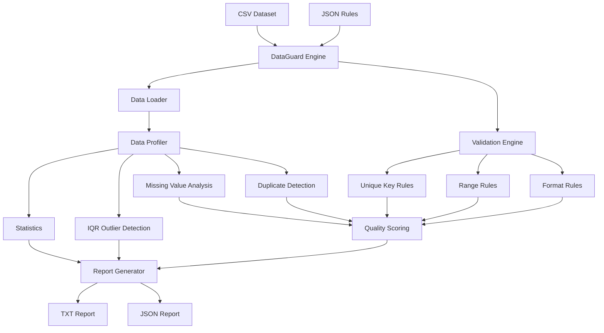

# DataGuard 🛡️

[](https://github.com/ThejeswarReddy661/dataguard/actions/workflows/tests.yml)

### Config-Driven Data Quality Validation & Profiling Engine

### Config-Driven Data Quality Validation & Profiling Engine

DataGuard is a lightweight Python data quality framework that automatically profiles CSV datasets, validates configurable business rules, detects anomalies, calculates a data quality score, and generates human-readable and machine-readable reports.

The same validation engine can be reused across different datasets by changing a JSON configuration file instead of modifying Python code.

---

## Why DataGuard?

Real-world datasets often contain problems such as:

- Missing values
- Duplicate records
- Duplicate primary keys
- Invalid numeric ranges
- Incorrectly formatted values
- Extreme outliers

Hard-coding validation logic separately for every dataset makes data pipelines difficult to maintain.

DataGuard separates:

```text
Dataset
   +
Validation Rules
   ↓
DataGuard Engine
   ↓
Quality Analysis
   ↓
TXT + JSON Reports
```

This allows the same engine to validate multiple datasets using different rule configurations.

---

## Architecture



## Key Features

- CSV dataset profiling
- Missing-value detection
- Duplicate-row detection
- Unique-key validation
- Configurable numeric range validation
- Email format validation
- IQR-based outlier detection
- Descriptive statistics
- Data quality scoring
- Severity classification
- JSON-configured validation rules
- TXT report generation
- JSON report generation
- Command-line dataset selection
- User-friendly error handling
- Automated unit testing

---

## Project Architecture

```text
dataguard/
│
├── config/
│   ├── rules.json
│   └── employees_rules.json
│
├── data/
│   ├── customers.csv
│   └── employees.csv
│
├── reports/
│   ├── customers_quality_report.txt
│   └── customers_quality_report.json
│
├── src/
│   ├── helpers.py
│   ├── loader.py
│   ├── main.py
│   ├── profiler.py
│   ├── reporting.py
│   ├── scoring.py
│   └── validators.py
│
├── tests/
│   └── test_dataguard.py
│
├── .gitignore
└── README.md
```

---

## How It Works

### 1. Load the Dataset

DataGuard reads a CSV dataset using Python's standard library.

### 2. Load Validation Rules

Dataset-specific validation rules are stored in JSON.

Example:

```json
{
  "unique_columns": ["customer_id"],

  "range_rules": {
    "age": {
      "min": 0,
      "max": 120
    },

    "salary": {
      "min": 0
    }
  },

  "format_rules": {
    "email": "email"
  },

  "outlier_columns": ["salary"]
}
```

### 3. Profile the Dataset

DataGuard analyzes:

- Dataset dimensions
- Missing values
- Duplicate records
- Descriptive statistics

### 4. Apply Validation Rules

Configured rules are applied without changing the underlying Python validation engine.

### 5. Detect Outliers

Numeric columns can be analyzed using the Interquartile Range (IQR) method.

```text
IQR = Q3 - Q1

Lower Bound = Q1 - 1.5 × IQR

Upper Bound = Q3 + 1.5 × IQR
```

Values outside these boundaries are flagged as potential outliers.

### 6. Calculate Data Quality Score

DataGuard combines multiple quality dimensions:

```text
Completeness
     +
Uniqueness
     +
Validity
     ↓
Overall Data Quality Score
```

Example:

```text
Overall Score: 87.8/100
Rating: GOOD
```

### 7. Generate Reports

Every analysis can produce:

```text
customers_quality_report.txt
customers_quality_report.json
```

The TXT report is human-readable.

The JSON report can be consumed by APIs, dashboards, automated pipelines, or other applications.

---

## Example

Run DataGuard with the default customer dataset:

```bash
python3 src/main.py
```

Example findings:

```text
Rows: 8
Columns: 5

age: 1 missing (12.5%) - MEDIUM
email: 2 missing (25.0%) - HIGH

Duplicate rows: 1 (12.5%) - MEDIUM

customer_id:
1 duplicate key value
Repeated values: ['1003']

age:
3 invalid values
Invalid values: ['-5', '-5', '240']

email:
1 invalid value
Invalid values: ['davidgmail.com']

Potential salary outliers: 1
Outlier values: ['9,500,000.00']

Overall Score: 87.8/100
Rating: GOOD
```

---

## Reusable Configuration

DataGuard is not tied to the customer dataset.

For example, analyze employee data with:

```bash
python3 src/main.py data/employees.csv config/employees_rules.json
```

DataGuard can use the same engine to detect:

```text
Duplicate employee IDs
Invalid experience values
Incorrect email formats
Missing values
Salary outliers
```

without modifying the validation engine.

---

## JSON Output

DataGuard also generates structured output:

```json
{
  "dataset": "customers.csv",

  "overview": {
    "rows": 8,
    "columns": 5,
    "total_cells": 40
  },

  "quality_score": {
    "score": 87.8,
    "rating": "GOOD"
  }
}
```

This makes the engine suitable for future integration with dashboards, APIs, and automated data pipelines.

---

## Automated Testing

DataGuard includes automated tests covering:

- Missing-value detection
- Percentage calculations
- Severity classification
- Duplicate-row detection
- Duplicate-key detection
- Numeric range validation
- Email validation
- Descriptive statistics
- IQR outlier detection
- Missing input files
- Invalid JSON
- Invalid configuration structure
- Empty datasets
- JSON report generation

Run the tests:

```bash
python3 -m unittest tests/test_dataguard.py -v
```

Current result:

```text
Ran 18 tests

OK
```

---

## Tech Stack

- Python
- CSV
- JSON
- unittest
- pathlib
- statistics
- Regular Expressions

The core engine is intentionally implemented using lightweight Python standard-library components.

---

## Skills Demonstrated

This project demonstrates practical experience with:

- Python software development
- Data quality engineering
- Data profiling
- Data validation
- Configuration-driven architecture
- Data pipeline concepts
- Statistical outlier detection
- Modular software design
- Error handling
- Automated testing
- JSON serialization
- Command-line applications

---

## Future Improvements

Planned extensions include:

- Large-dataset benchmarking
- Additional validation rule types
- Configurable quality-score weights
- HTML reporting
- Interactive dashboard
- REST API integration
- Automated pipeline integration
- Historical quality tracking

---

## Author

**Thejeswar Reddy Mallu**

Data Engineering | Data Analytics | Python | SQL

## Sample Output

Example customer dataset result:

```text
DATAGUARD - DATA QUALITY REPORT

Rows: 8
Columns: 5
Total cells: 40

Missing Values
age: 1 missing (12.5%) - MEDIUM
email: 2 missing (25.0%) - HIGH

Duplicate Rows
1 duplicate row (12.5%) - MEDIUM

Unique Key Check
customer_id: 1 duplicate key
Repeated values: ['1003']

Range Validation
age: 3 invalid values
Invalid values: ['-5', '-5', '240']

Format Validation
email: 1 invalid value
Invalid values: ['davidgmail.com']

Outlier Analysis
salary: 1 potential outlier
Outlier value: 9,500,000

Data Quality Score
87.8 / 100
Rating: GOOD
```

Generated reports:

```text
reports/
├── customers_quality_report.txt
└── customers_quality_report.json
```
