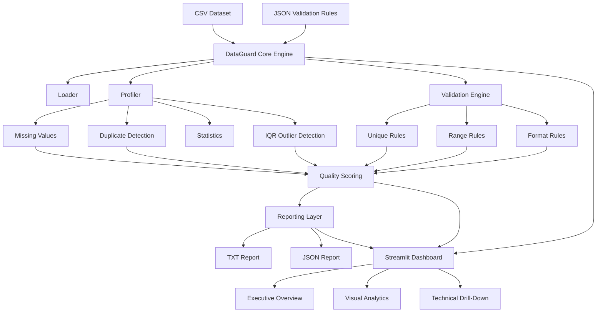

# DataGuard 🛡️

[](https://github.com/ThejeswarReddy661/dataguard/actions/workflows/tests.yml)
[](https://dataguard-thejeswar.streamlit.app)

## Config-Driven Data Quality Validation & Profiling Engine

DataGuard is a Python data-quality application that profiles CSV datasets, validates configurable business rules, detects anomalies, calculates an explainable data-health score, and produces human-readable and machine-readable reports.

The same core engine supports both a **command-line workflow** for repeatable validation and an **interactive Streamlit dashboard** for business-friendly exploration and technical drill-down.

Instead of hard-coding validation logic for every dataset, dataset-specific expectations live in JSON configuration files. The engine stays reusable while the rules change.

---

## Live Demo

**Try DataGuard in your browser:** https://dataguard-thejeswar.streamlit.app

The deployed Streamlit app supports:

- Demo datasets, including the 500,000-row benchmark dataset
- Executive data-health summary
- Top-priority findings and recommended actions
- Visual analytics and score explanation
- Technical drill-down for analysts and engineers
- Custom CSV + JSON validation-rule upload
- TXT and JSON report downloads

## Why DataGuard?

Real-world datasets frequently contain missing information, duplicate records, duplicate identifiers, values outside valid business ranges, incorrectly formatted fields, and statistically unusual values. These problems can silently affect reporting, analytics, machine-learning pipelines, and operational decisions.

DataGuard turns those problems into an explainable workflow:

```text
CSV Dataset + JSON Rules
          |
          v
   DataGuard Engine
          |
          +-- Profiling
          +-- Validation
          +-- Outlier Detection
          +-- Quality Scoring
          |
          v
 CLI Reports + Interactive Dashboard
```

---

## Key Features

### Data Profiling

- Dataset dimensions
- Missing-value analysis
- Duplicate-row detection
- Descriptive statistics
- IQR-based outlier detection

### Config-Driven Validation

- Unique-column rules
- Numeric range rules
- Email-format validation
- Dataset-specific JSON configurations
- Reusable validation engine across multiple datasets

### Explainable Data Quality

- Overall data-health score
- Missing Data Health
- Duplicate Data Health
- Rule Compliance
- Unusual Value Check
- Severity / priority classification
- Transparent score breakdown

### Interactive Dashboard

- Executive overview
- Business-friendly readiness status
- Top-priority findings
- Recommended actions
- Data-health dimension visualization
- Issues-by-priority visualization
- Findings-by-column visualization
- Detailed findings table
- Invalid-vs-unusual explanation
- Advanced technical drill-down
- TXT and JSON report downloads
- Demo-dataset selection
- Custom CSV + JSON-rule upload

### Engineering

- Modular Python architecture
- CLI execution
- Automated backend tests
- Streamlit dashboard smoke tests
- GitHub Actions continuous integration
- Large-dataset performance benchmarking
- User-friendly input and configuration error handling

---

## Architecture



A key design decision is that the dashboard does **not** implement a separate validation system. The CLI and Streamlit application reuse the same profiling, validation, scoring, and reporting logic.

---

## Project Structure

```text
dataguard/
|
+-- .github/
|   +-- workflows/
|       +-- tests.yml
+-- config/
|   +-- rules.json
|   +-- employees_rules.json
+-- data/
|   +-- customers.csv
|   +-- employees.csv
|   +-- large_customers.csv
+-- reports/
|   +-- customers_quality_report.txt
|   +-- customers_quality_report.json
+-- src/
|   +-- dashboard.py
|   +-- generate_large_dataset.py
|   +-- helpers.py
|   +-- loader.py
|   +-- main.py
|   +-- profiler.py
|   +-- reporting.py
|   +-- scoring.py
|   +-- validators.py
+-- tests/
|   +-- test_dashboard.py
|   +-- test_dataguard.py
+-- .gitignore
+-- requirements.txt
+-- README.md
```

---

## How It Works

### 1. Load Data

DataGuard reads a CSV dataset and identifies its columns and records.

### 2. Load Validation Rules

Dataset-specific expectations are defined in JSON instead of being embedded throughout the Python code.

```json
{
  "unique_columns": ["customer_id"],
  "range_rules": {
    "age": {
      "min": 0,
      "max": 120
    },
    "salary": {
      "min": 0
    }
  },
  "format_rules": {
    "email": "email"
  },
  "outlier_columns": ["salary"]
}
```

### 3. Profile the Dataset

The profiling layer evaluates dataset dimensions, missing information, duplicates, descriptive statistics, and configured numeric columns.

### 4. Apply Business Rules

The validation engine applies uniqueness, range, and format rules from the selected JSON configuration. A new dataset can therefore use different business rules without rewriting the validation engine.

### 5. Detect Unusual Values

Configured numeric columns can be evaluated using the Interquartile Range (IQR) method:

```text
IQR = Q3 - Q1
Lower Bound = Q1 - 1.5 x IQR
Upper Bound = Q3 + 1.5 x IQR
```

Values outside these boundaries are treated as **potential outliers**, not automatically as errors.

### 6. Calculate Data Health

The dashboard explains overall health through four dimensions:

```text
Missing Data Health
        +
Duplicate Data Health
        +
Rule Compliance
        +
Unusual Value Check
        |
        v
Overall Data Health Score
```

The UI translates the numeric result into a business-oriented readiness status such as:

```text
84.4 / 100
USABLE WITH REVIEW
```

### 7. Generate Results

```text
TXT report  -> human-readable analysis
JSON report -> structured output for downstream systems
Dashboard   -> interactive business and technical exploration
```

---

## Interactive Dashboard

Start the Streamlit application from the project root:

```bash
streamlit run src/dashboard.py
```

The dashboard uses progressive disclosure. A business or non-technical viewer can start with:

```text
Executive Overview
        |
        v
Top Priorities
        |
        v
Recommended Actions
        |
        v
Visual Analytics
```

A technical reviewer can continue into detailed findings, validation rules, invalid-value samples, IQR analysis, and engineering/performance information.

### Invalid vs. Unusual

**Invalid value:** violates a configured business rule.

```text
age = 240
allowed range = 0-120
```

**Unusual value:** statistically uncommon according to IQR analysis but may still be legitimate.

```text
salary = 9,500,000
```

This prevents the application from automatically treating every statistical anomaly as bad data.

---

## Run from the CLI

Default customer dataset:

```bash
python3 src/main.py
```

Employee dataset with a different configuration:

```bash
python3 src/main.py data/employees.csv config/employees_rules.json
```

The same engine can therefore analyze different datasets without source-code changes to the validation logic.

---

## Reports

A CLI analysis generates:

```text
reports/customers_quality_report.txt
reports/customers_quality_report.json
```

The TXT output supports human review. The JSON output can be consumed by dashboards, APIs, monitoring systems, or automated pipelines.

Example JSON structure:

```json
{
  "dataset": "customers.csv",
  "overview": {
    "rows": 8,
    "columns": 5,
    "total_cells": 40
  },
  "quality_score": {
    "score": 87.8,
    "rating": "GOOD"
  }
}
```

The CLI and dashboard can present the same underlying analysis differently because the dashboard adds a business-facing interpretation layer.

---

## Performance Benchmark

DataGuard was benchmarked locally on a synthetic customer dataset containing **500,000 rows** and approximately **27 MB** of CSV data.

The benchmark dataset intentionally includes:

- 334 missing email values
- 200 invalid age values
- 166 malformed email values
- 100 salary outliers

The benchmark covers the complete CLI workflow:

```text
CSV loading
    |
Missing-value profiling
    |
Duplicate checks
    |
Config-driven validation
    |
IQR outlier detection
    |
Quality scoring
    |
TXT + JSON report generation
```

Observed local runtime:

```text
~1.69 seconds
```

Run the benchmark:

```bash
time python3 src/main.py data/large_customers.csv config/rules.json
```

Regenerate the synthetic dataset:

```bash
python3 src/generate_large_dataset.py
```

> Benchmark results depend on hardware, Python version, operating system, and dataset characteristics. The 1.69-second figure is the observed local result for this project setup.

---

## Automated Testing

DataGuard currently has **23 automated tests**.

```text
Backend / engine tests: 18
Dashboard smoke tests:   5
---------------------------
Total:                   23
```

Coverage includes:

- Missing-value detection
- Percentage calculations
- Severity classification
- Duplicate-row detection
- Duplicate-key validation
- Numeric range validation
- Email validation
- Descriptive statistics
- IQR outlier detection
- Missing input files
- Invalid JSON and configuration structures
- Dataset-header validation
- JSON report generation
- Streamlit application startup
- Dashboard metrics and controls
- Report download controls
- Advanced analysis sections

Run the complete suite:

```bash
python -m unittest discover -s tests -v
```

Current verified local result:

```text
Ran 23 tests in 1.025s

OK
```

---

## Continuous Integration

GitHub Actions runs the automated test suite for repository changes.

```text
Repository change
       |
       v
GitHub Actions
       |
       v
Set up Python
       |
       v
Install dependencies
       |
       v
Run test suite
       |
       v
Pass / Fail
```

The badge at the top of this README reflects the workflow status.

---

## Installation

### 1. Clone

```bash
git clone https://github.com/ThejeswarReddy661/dataguard.git
cd dataguard
```

### 2. Create a virtual environment

```bash
python3 -m venv .venv
```

### 3. Activate it

macOS / Linux:

```bash
source .venv/bin/activate
```

Windows PowerShell:

```powershell
.venv\Scripts\Activate.ps1
```

### 4. Install dependencies

```bash
python -m pip install -r requirements.txt
```

### 5. Run the CLI

```bash
python3 src/main.py
```

### 6. Run the dashboard

```bash
streamlit run src/dashboard.py
```

### 7. Run all tests

```bash
python -m unittest discover -s tests -v
```

---

## Tech Stack

- Python
- Streamlit
- CSV
- JSON
- unittest
- pathlib
- statistics
- Regular Expressions
- GitHub Actions

The core validation engine intentionally remains lightweight while Streamlit provides the interactive presentation layer.

---

## Engineering Concepts Demonstrated

- Data quality engineering
- Data profiling
- Business-rule validation
- Configuration-driven architecture
- Data pipeline concepts
- Statistical anomaly detection
- Modular Python design
- Separation of concerns
- CLI application development
- Interactive data applications
- Error handling
- JSON serialization
- Automated testing
- Continuous integration
- Performance benchmarking
- Business-friendly presentation of technical results

---

## Design Decisions

### Configuration instead of hard-coded rules

Validation expectations live in JSON files so the core engine can be reused.

### One engine, multiple interfaces

The CLI and Streamlit dashboard use the same underlying validation components instead of duplicating business logic.

### Invalid does not mean unusual

Business-rule violations and statistical anomalies are intentionally separated.

### Human-readable + machine-readable output

TXT reports support people while JSON reports support downstream software.

### Business summary + technical drill-down

The dashboard starts with decision-oriented information while preserving deeper validation and statistical details for technical users.

---

## Potential Extensions

The current project is intentionally scoped as a completed portfolio application. Its architecture leaves room for future additions such as:

- Additional validation-rule types
- Configurable score weights
- REST API integration
- Scheduled pipeline execution
- Historical data-quality tracking
- Data-quality trend monitoring
- Database and cloud-storage connectors

---

## Interview Summary

> **DataGuard is a config-driven Python data-quality engine I built to separate reusable validation logic from dataset-specific business rules. It profiles CSV data, detects missing and duplicate records, validates uniqueness, ranges, and formats, identifies IQR-based outliers, calculates an explainable quality score, and generates TXT and JSON reports. I built a Streamlit dashboard on top of the same engine for business-friendly prioritization and technical drill-down, added automated backend and dashboard tests, integrated CI through GitHub Actions, and benchmarked the end-to-end CLI workflow on a 500,000-row dataset.**

---

## Author

**Thejeswar Reddy Mallu**

Data Engineering | Data Analytics | Python | SQL
